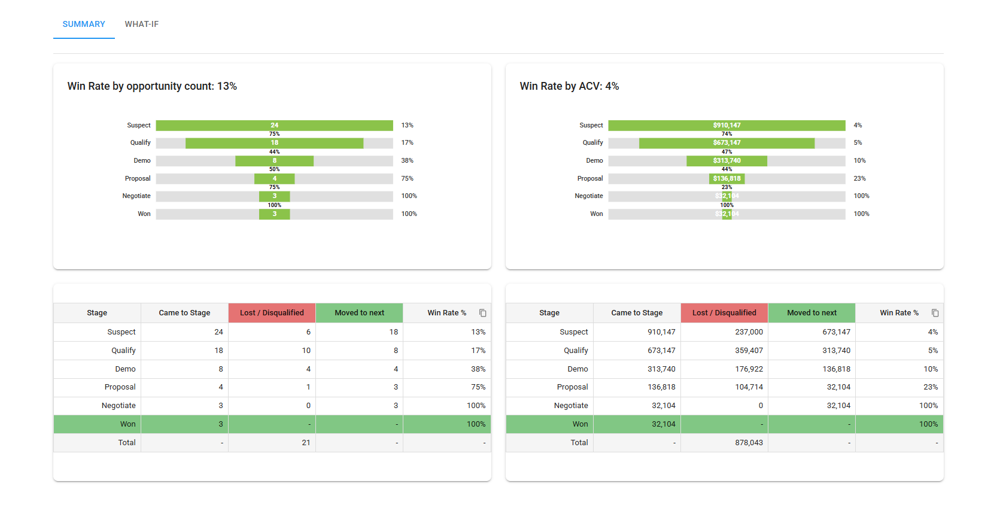
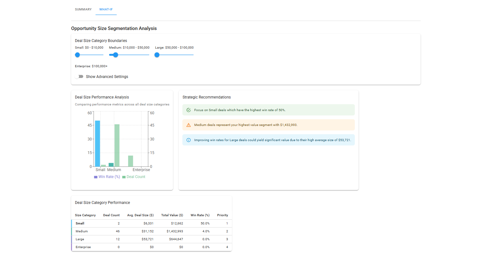

# 🌤️ SkyGeni Assignment

A full-stack web application built with modern technologies, showcasing interactive UI components and data visualization.

---

## 🚀 Tech Stack

### 🔧 Frontend
- ⚛️ [React](https://reactjs.org/)
- 🎨 [Material UI](https://mui.com/)
- 📊 [D3.js](https://d3js.org/)

### 🛠️ Backend
- 🌐 [Node.js](https://nodejs.org/)
- 🚂 [Express.js](https://expressjs.com/)

## How to Run the Project

1. **Clone the Repository:**

   ```bash
   git clone https://github.com/eshaalal/skygeni_assignment.git
   ```

2. **Install Dependencies:**

   Navigate to the project directory and install the required dependencies:

   ```bash
   cd frontend
   npm install
   npm run dev
   ```
   ```bash
   cd backend
   npm install
   node server.js
   ```


